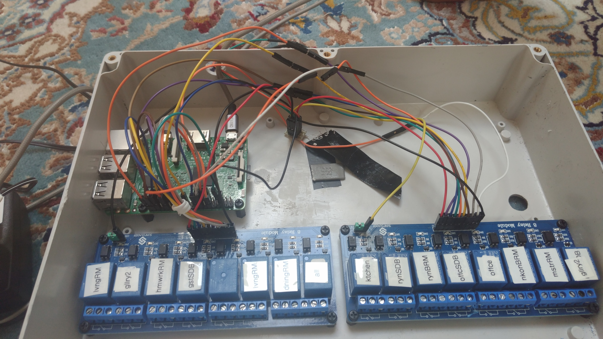

# Lights: here's what you do when they get fried
During the summer between my 8th and 9th grade school years, my neighborhood experienced a series of short power outages. By some odds, the last power outage sent a surge through our electrical closet, and all our house's original lighting boards were fried. As a 50+ year old house, the lighting board was not possible to replace; it was a good laugh looking through all the old UV-programmed IC chips and bulky components, but we really did have to do something about the lighting boards. As father's day was approaching, I had the idea to surprise my father with an all new lighting system. I had been learning how to write websites in `React` in the months prior to the outage, and I already had the hardware skills to whip up the project quickly. I ordered relay boards, i2c breakout ICs, and a ton of 12-gauge copper cables to plug into the leads which the old system left exposed in the closet. I used a Firebase real-time database to keep track of all the different requests to the lights, and this allowed the latency of the lighting system to be imperceptible. In concert with the website, I constructed two identical boxes containing a raspberry pi and two 8x1 relay boards to listen for changes in the database and write to the relays accordingly. I eventually created a more concise implementation of the relay boards using i2c expansion chips. We ultimately switched to a system that complied with city codes — meaining off-the-shelf — so don't worry about messing around on the website; the lights are not hooked up to the demonstration link.
## Instructions to run
    1. Navigate to folder */Lights*
    2. *NPM install --save -g*
    3. *NPM install*
    4. *node app.js*
    5. Navigate to localhost in browser
    6. Enjoy!
Here is the following link to visit the lighting website and explore the different pages:
<http://keystockstudios.com>
## Demonstration of function

